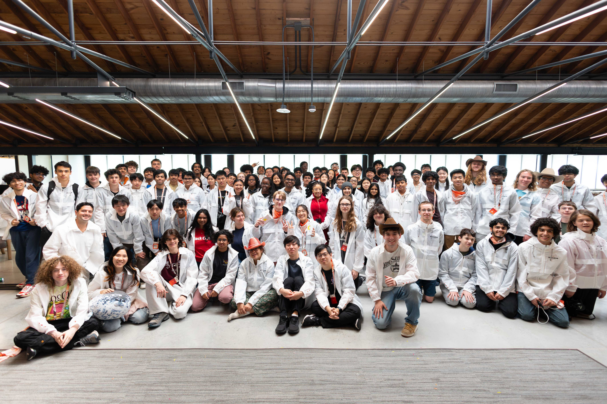

I will never forget the fresh smell of Popeyes, and the fear of being seen by others feasting on a chickenwing in the middle of the Dallas/Fort Worth airport.

# introduction
Last week, I had the great privilege of attending the Hack Club Stasis Hackathon in Austin, Texas. 

# personal opinions

For my first hackathon, I was greatly impressed by the organizational skills of what were mostly teenagers like myself. Websites for voting, scheduling, and even the commnual shower worked almost perfectly with no issues. The choice of activity and food were great as well, which is very important because I get very hungry.

# jack dorsey and michael dell (and VCs)

At this event, I am prooud to say that I had the pleasure of spekaingw ith Jack Dorse, Michael Dell, and a few other important figures venture captalist community. I greatly enjoyed engaging in meaningful conversations with the 'uncs' of the computer engienering world.

## Dorsey

Jack Dorsey, the former CEO of Twitter and the current CEO of Square, is a considerably unusual figure. Amidst our conversations about hack clubxs and eingeering asa whole, Dorsey had a few genuine thoughts about his contributions to the world. For one, he felt greatly disconnected from his original ideas for his technology, and he admits to guilt and the idea that the world can change something you've made.

## Dell

Dell did not choose the traidtional approach of hosting an interview/AMA through hack club. Instead, he walked around as we continued wrok on our projects and offered advice while answering questions.

# conclusion and further thoughts

For a computer engineer, this is embarassign to admit, but Stasis was one of the first times I actually made an attempt at soldering. I failed miserably and I burned straight through a PCB. I also melted a light switch, much to the confusion of other attendees and the event organizers.
