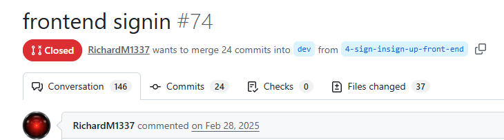
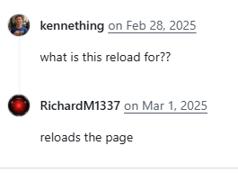

## Background

At the dawn of time, every innovation had a criticism. Tools, paper, gunpowder, even the nuclear bomb. Oonga Boonga, the guy who invented agriculture, probably was made fun of by his Neanderthal peers for believing fruits and vegetables just magically come out the ground.

Of course, artificial intelligence with all its pitfalls is more comparable to an atomic nothingburger than the likes of sliced bread. With all its benefits in mind, the average population seem to be using the best of artificial intelligence for the worst reason.

When I was approached with programming the backend services for a research opportunity involving the lengths of artificial intelligence in art, I signed on immediately. My personal opinion of artificial intelligence has always been that it should replace the menial tasks, not the artistic endeavors that mankind is most known for.

## What is this project?

This project is a website that has users play a 'game' where they guess which of the pieces displayed on their screen is real, and which is artificial intelligence. The information is anonymously submitted to the backend, for research purposes.

## Technical Skills

In order to build this project, various factors needed to be accounted for.

1.  Storing the photos that are both real and artificially generated
2.  Storing some sort of user score that can be used for the research project
3.  Splitting the photos between categories, to make the game more appealing.

Because of the necessity for data to be stored in a backend, my personal vendetta for _Django_, and the group's collective experience with _Vue_, we decided to move forward with a MEVN stack.

## Struggles

Throughout this project, I made a few mistakes and had various struggles when working. This included a [very memorable Pull Request](https://github.com/sitechtimes/ai-vs-human-art-frontend/pull/74).

In the subculture of computer scientists and other webdevs at my school, the action of completely trashing and dogpiling on a failed commit or pull request was lovingly and colloquially referred to as "exploding".

## Reflection
